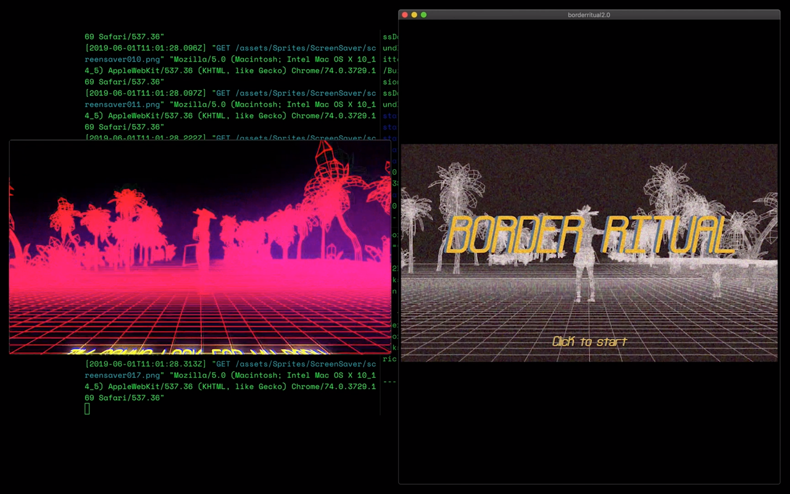

[borderritual2.0]
============================================

A 2D side-scroller made in p5.js library as part of a 6 week workshop with Code Liberation at the Victoria and Albert Museum in London.

In this game, you play Nkechi a migrant passing through the border. She experiences a moment of biometric failure during her border interview, which she has to intervene upon with her trickster tokens. Collect 20 tricskter tokens to beat the biometric system.

Instructions to Play the Game
-------------------------------------------

Click your mouse to move through cutscenes and jump

Setting Up the Game on Your Computer
--------------------------------------------

### Method One

This game requires a browser with a  [local server] started in terminal to be played locally.

### Method Two

The simplest method to bypass this is to download and install [atom] and play the game in the [browser plus] add-on.

### Launch File

The game's file is [public/index.html]. Launch this file in your default browser if you used method one or in browser plus if you used method two.

This is my first try creating a game in Javascript, so it is not optimized properly.

Loading will take a while. Bear with me.

TODO
---------------------------------------------

- [ ] Add loading page
- [ ] Optimize app for better performance on Heroku

[borderritual2.0]: https://borderritual2.herokuapp.com
[local server]: https://github.com/processing/p5.js/wiki/Local-server
[atom]: https://atom.io 
[browser plus]: https://atom.io/packages/browser-plus
[public/index.html]: https://github.com/tokinifubara/borderritual2.0/blob/master/public/index.html
